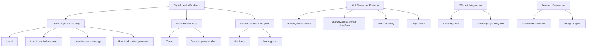

<h1 align="center">Hi, I'm Edison Taimu 👋</h1>

  Building practical AI, digital health, and developer platform tools from Malawi 🇲🇼

  
  

---

## 👋 Introduction

I design and build software at the intersection of **AI**, **nutrition/health technology**, and **developer infrastructure**.  
My GitHub work shows a recurring focus on:

- health-facing products and coaching systems
- AI proxy and assistant backends
- SDKs and integration tooling
- research-oriented metabolism/energy simulation work
- documentation and developer enablement

---

## 🚀 What I Build

I build end-to-end technical ecosystems that combine:

- **Applications** (dashboards, web apps, coaching experiences)
- **AI services** (proxy workers, assistant backends, MCP servers)
- **Platform tooling** (SDKs and gateway integrations)
- **Research/Modeling** (metabolism + energy simulation components)

---

## 🧠 Technical Ecosystem (from current repositories)

---

## ⭐ Featured Projects

> Curated for technical depth, originality, ecosystem value, and clear product direction.

| Project | Why it’s notable | Tech (from repo metadata/themes) | Link |
|---|---|---|---|
| **thanzi** | Flagship health/nutrition product direction (“Malawi’s first food & fitness tracker”). Foundational product repo in your ecosystem. | JavaScript | [thanzi](https://github.com/edisontaimu9-ui/thanzi) |
| **chakudya-mcp-server-cloudflare** | Strong platform engineering signal: MCP + Cloudflare deployment model suggests production-minded AI tooling. | TypeScript | [chakudya-mcp-server-cloudflare](https://github.com/edisontaimu9-ui/chakudya-mcp-server-cloudflare) |
| **chakudya-mcp-server** | Core MCP server implementation; useful for assistant/tooling interoperability and backend AI workflows. | TypeScript | [chakudya-mcp-server](https://github.com/edisontaimu9-ui/chakudya-mcp-server) |
| **thanzi-coach-dashboard** | Operational product component for coaching workflows; complements Thanzi app layer. | JavaScript | [thanzi-coach-dashboard](https://github.com/edisontaimu9-ui/thanzi-coach-dashboard) |
| **thanzi-coach-whatsapp** | Interesting applied integration angle: coaching through messaging channel UX. | JavaScript | [thanzi-coach-whatsapp](https://github.com/edisontaimu9-ui/thanzi-coach-whatsapp) |
| **Chakudya-sdk** | Demonstrates reusable developer tooling mindset (not just app building). | JavaScript | [Chakudya-sdk](https://github.com/edisontaimu9-ui/Chakudya-sdk) |
| **paychangu-gateway-sdk** | Real-world integration capability around payment/gateway abstractions. | JavaScript | [paychangu-gateway-sdk](https://github.com/edisontaimu9-ui/paychangu-gateway-sdk) |
| **Metabolism-simulator-** | Research-oriented technical depth through domain simulation work. | Python | [Metabolism-simulator-](https://github.com/edisontaimu9-ui/Metabolism-simulator-) |
| **energy-engine-** | Complementary computation/modeling direction aligned with health-energy analysis. | Python | [energy-engine-](https://github.com/edisontaimu9-ui/energy-engine-) |

---

## 🧠 Areas of Focus

- **Digital Health Engineering**: nutrition, coaching, and health-professional-facing tools  
- **Applied AI Systems**: proxy layers, assistant architecture, MCP server workflows  
- **Developer Platform Work**: SDKs, integration abstractions, docs/tooling  
- **Computational Research Components**: metabolism and energy simulation models  
- **Multi-channel Product Delivery**: dashboards, web interfaces, and messaging integrations

---

## 🛠️ Tech Stack

  
  
  
  

  
  
  
  

---

## 📊 GitHub Stats

  
  

---

## 🔥 Contribution / Activity

  

---

## 🌐 Projects & Links

- Profile Repository: [edisontaimu9-ui/edisontaimu9-ui](https://github.com/edisontaimu9-ui/edisontaimu9-ui)
- GitHub Pages Repo: [edisontaimu9-ui/edisontaimu9-ui.github.io](https://github.com/edisontaimu9-ui/edisontaimu9-ui.github.io)
- Documentation Work: [edisontaimu9-ui/Chakudya-docs](https://github.com/edisontaimu9-ui/Chakudya-docs)
- Portfolio Repo: [edisontaimu9-ui/Portfolio-](https://github.com/edisontaimu9-ui/Portfolio-)

---

## 📚 Research / Technical Work

Your repositories show active exploration in **health computation and applied AI**, especially through:

- **Metabolism simulation** → [`Metabolism-simulator-`](https://github.com/edisontaimu9-ui/Metabolism-simulator-)
- **Energy modeling engine** → [`energy-engine-`](https://github.com/edisontaimu9-ui/energy-engine-)
- **AI health interfaces/services** → `moyocare-ai`, `thanzi-ai-proxy`, `chakudya-mcp-server*`

This combination is a strong niche: **domain-aware health software + AI infrastructure**.

---

## 🎯 Currently Building

Based on repository naming and recent project direction, your active ecosystem appears centered on:

- expanding the **Thanzi** coaching/product suite
- advancing **Chakudya MCP + SDK** platform components
- integrating AI services into practical health workflows

---

## 📫 Connect

- GitHub: [@edisontaimu9-ui](https://github.com/edisontaimu9-ui)

---

<strong>Repository Universe Considered</strong>

- edisontaimu9-ui
- bizmate
- chakudya-mcp-server-cloudflare
- thanzi-coach-whatsapp
- Portfolio-
- thanzi-coach-dashboard
- thanzi
- chakudya-mcp-server
- Oasis-
- thanzi-guide-
- Chakudya-docs
- Oasis-ai-proxy-worker-
- Metabolism-simulator-
- Chakudya-sdk
- energy-engine-
- moyocare-ai
- thanzi-education-generator
- paychangu-gateway-sdk
- dietitianos
- ncrs-frontend
- edisontaimu9-ui.github.io
- thanzi-ai-proxy

